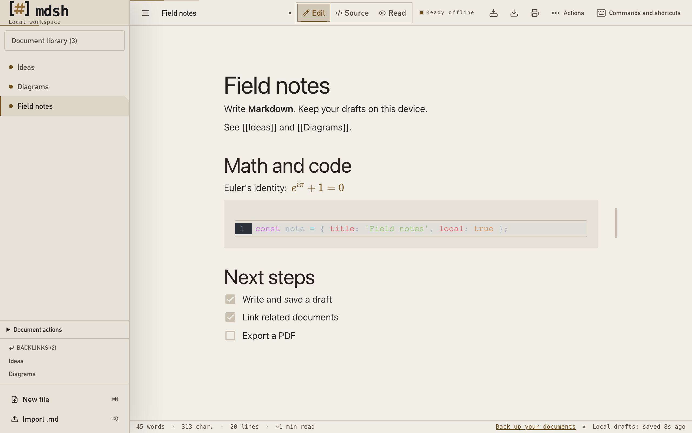

<p align="center">
  <picture>
    <source media="(prefers-color-scheme: dark)" srcset="static/brand/logo-dark.svg">
    <source media="(prefers-color-scheme: light)" srcset="static/brand/logo-light.svg">
    
  </picture>
</p>

<h1 align="center">Markdown, without detours.</h1>

<p align="center">
  A local Markdown workspace. Write, connect, and export your documents.<br>
  No account. No server. No tracking.
</p>

<p align="center">
  <a href="https://thomascrouzet.github.io/mdsh/"><strong>Open the web app</strong></a> ·
  <a href="https://github.com/ThomasCrouzet/mdsh/releases">Download Desktop Beta</a> ·
  <a href="docs/USER_GUIDE.md">User guide</a>
</p>

<p align="center">
  <a href="https://github.com/ThomasCrouzet/mdsh/actions/workflows/deploy.yml"></a>
  <a href="https://github.com/ThomasCrouzet/mdsh/actions/workflows/security.yml"></a>
  <a href="LICENSE"></a>
</p>


## One document, three views

**Edit** with a visual Markdown editor. Use `/h1` or `/t1` for a heading, add a
checklist, and insert images. **Source** gives you the Markdown directly, with
syntax highlighting, search, replacement, and per-document undo. **Read** shows
the rendered document with an outline for navigation.

Switch views without leaving your document. Choose the light, dark, or system
theme. The bracket-and-hash logo, warm text, and amber accents keep the interface
consistent across the web app and Desktop.

## A workspace that stays local

| Write | Organize | Take your work with you |
| --- | --- | --- |
| GFM tables, task lists, and code | Open and closed documents in one library | Markdown and ZIP export |
| KaTeX formulas and Mermaid diagrams | Tags, search, and cross-file replacement | Content-only PDF export |
| YAML front matter and embedded images | Wiki links, backlinks, and a link graph | Self-contained offline HTML |
| Heading shortcuts and document outlines | Workspaces, templates, and version history | JSON backup, with optional encryption |

- **Manage many documents:** filter the library, select several documents, or move
  the full library to trash. Restore individual documents or empty the trash.
- **Keep disk links:** save back to an opened file in supported browsers and
  Desktop. Revision checks detect external edits before an overwrite.
- **Check the PDF width:** select **PDF (A4)** for a guide to the 178 mm text area.
  The print dialog controls the final page settings.
- **Work offline:** install the PWA and wait for offline preparation to finish.
  Editing, rendering, search, and export then work without a connection.
- **Use English or French:** change the interface language in Settings.

<details>
<summary><strong>See the light theme and reading view</strong></summary>




</details>

## Start in your browser or on Desktop

The [web app](https://thomascrouzet.github.io/mdsh/) needs no installation.
Create a file, import Markdown, or open the built-in demo. Use your browser's
install action to add the [PWA](docs/USER_GUIDE.md#install-the-pwa).

| Platform | Editing and export | Save back to a disk file |
| --- | --- | --- |
| Chromium | Full desktop and mobile browser tests | File System Access API where available |
| Firefox | Core workflow tests | Download fallback |
| Safari / WebKit | Core desktop and mobile workflow tests | Download fallback |
| Desktop Beta | Local Tauri app, native WebView tests | Native file access on macOS, Windows, and Linux |

[Desktop Beta downloads](https://github.com/ThomasCrouzet/mdsh/releases) are separate
prereleases. Installers are unsigned and can trigger an operating-system warning.
Each release includes checksums, dependency inventories, and build provenance.
See the [Desktop guide](docs/USER_GUIDE.md#desktop-beta-app) for requirements.

## Your data and privacy

Drafts stay in IndexedDB in your browser profile. The app saves after a **400 ms**
delay and reports write failures. Closing a tab keeps the document in the library.
Deleting a document moves it to trash for 30 days.

Browser storage is not a backup. Export backups from Settings before clearing
browser data or changing profiles. Backups include open and closed documents,
workspaces, and custom templates. They exclude trash, version history, and disk
permissions. Optional encryption uses AES-GCM and PBKDF2 through WebCrypto.

The app has no backend, account, telemetry, cloud sync, or runtime CDN. It sanitizes
document HTML and blocks remote images until you explicitly load them for that
document. Loading a remote image contacts its host. See [SECURITY.md](SECURITY.md)
and the [backup guide](docs/USER_GUIDE.md#backups-and-storage-health).

## Useful shortcuts

Use **Control** instead of **Command** on Windows and Linux. Commands lists all
shortcuts, and Settings lets you change them.

| Shortcut | Action |
| --- | --- |
| `Cmd+N` / `Cmd+O` | New document / import Markdown |
| `Cmd+E` / `Cmd+/` / `Cmd+R` | Edit / Source / Read |
| `Cmd+Shift+P` | Command palette |
| `Cmd+F` / `Cmd+Shift+F` | Find in document / search across documents |
| `Cmd+S` / `Cmd+Shift+S` | Export Markdown / save to disk |
| `Cmd+P` / `Cmd+,` | Export PDF / Settings |
| `Ctrl+Tab` / `Ctrl+Shift+Tab` | Next / previous open document |

The interface supports keyboard navigation and reduced motion. Browser tests
check focus behavior and accessibility rules. These checks do not replace a human
accessibility audit.

## Build and contribute

Use **Node 22 or later** and npm. The committed lockfile fixes dependency versions.

```sh
npm ci --legacy-peer-deps
npm run dev
```

Before a pull request:

```sh
npm run check
npm run lint
npm test
npm run build
npm run size
npx playwright install --with-deps chromium firefox webkit
npx playwright test --ignore-snapshots --grep-invert "Snapshots visuels"
```

On Linux without a display, prefix the final command with `xvfb-run -a`.
Browser tests produce HTML and JSON reports. E2E tests are the preferred method;
isolated tests cover documented failure risks that browser workflows miss.
See the [test policy and artifacts](docs/TESTING.md).

The stack uses **Svelte 5**, **SvelteKit**, **TypeScript**, **Milkdown**,
**CodeMirror**, **Dexie**, and **Tauri 2**. Desktop builds also need the Rust version
and native libraries specified in [CONTRIBUTING.md](CONTRIBUTING.md).

The working target is about 200 to 300 documents. Cloud services, collaboration,
and plugins are outside the project scope. Visual editing can normalize Markdown;
use Source when exact formatting matters.

[Architecture](ARCHITECTURE.md) · [Development](docs/DEVELOPMENT.md) ·
[Brand assets and demo capture](docs/BRANDING.md) · [Issues](https://github.com/ThomasCrouzet/mdsh/issues) ·
[Support](SUPPORT.md)

## License

[MIT](LICENSE). See [THIRD_PARTY_NOTICES.md](THIRD_PARTY_NOTICES.md) for redistributed
asset notices.
