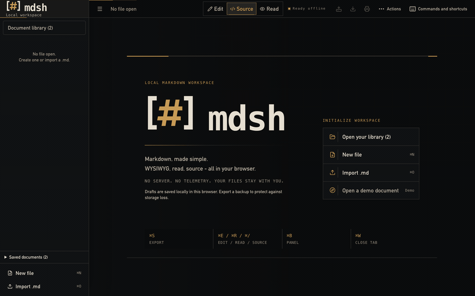
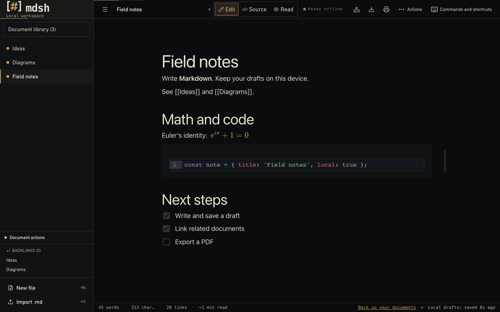
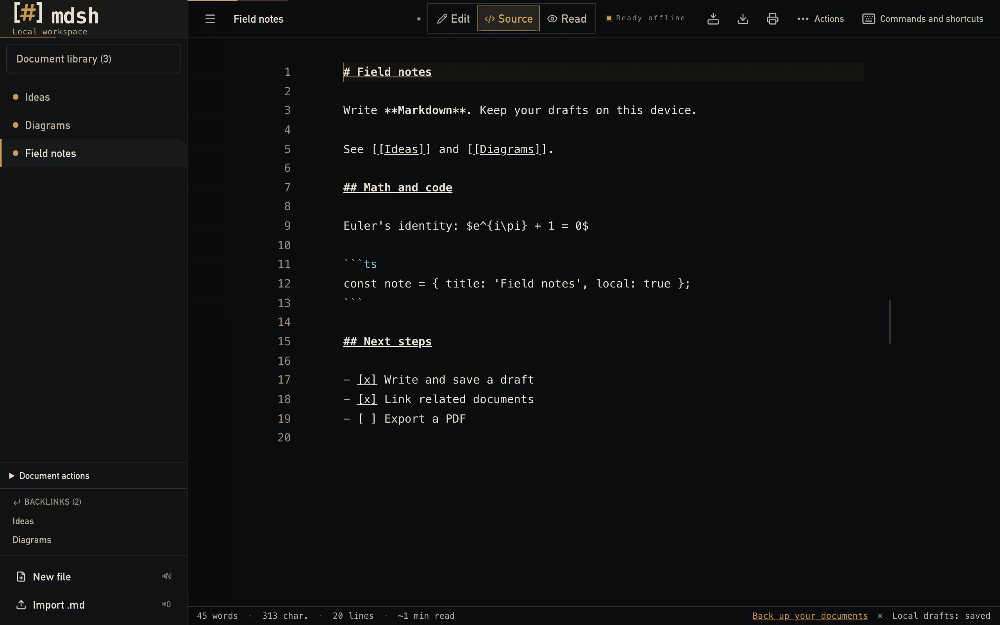
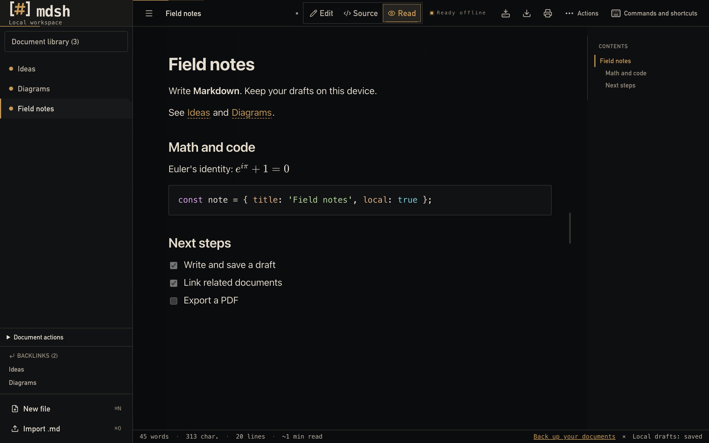
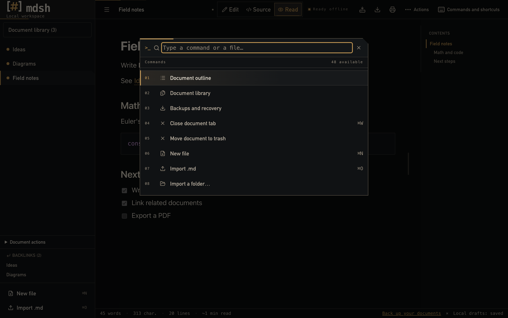

# `$ mdsh`

[](https://thomascrouzet.github.io/mdsh/)
[](https://github.com/ThomasCrouzet/mdsh/actions/workflows/deploy.yml)
[](#development)
[](.size-limit.json)
[](https://github.com/ThomasCrouzet/mdsh/actions/workflows/deploy.yml)
[](LICENSE)

### → [Try the live demo](https://thomascrouzet.github.io/mdsh/)

**A markdown workspace that never phones home.** WYSIWYG editor, offline, 100% client-side - light / dark / system theme.
No server, no telemetry, no account. Your files never leave the browser.

**Why mdsh?** Because writing markdown should not require an account, a connection, or trust in a third-party server: you open a tab, you write in WYSIWYG, everything is saved locally and stays readable offline. Local-first is the one non-negotiable - the feature set below (link graph, presentation mode, version history, templates, encrypted backups) exists to serve that principle, not to turn the editor into a platform.



<table>
	<tr>
		<td width="50%"></td>
		<td width="50%"></td>
	</tr>
	<tr>
		<td width="50%"></td>
		<td width="50%"></td>
	</tr>
</table>

## Features

- **3 modes** - WYSIWYG (Milkdown Crepe), source (CodeMirror 6), reading (with a floating TOC)
- **Full markdown** - GFM, code highlighting, KaTeX math, Mermaid (live preview in WYSIWYG too), YAML front-matter, wiki-links `[[Target]]` + backlinks
- **Multi-file** - tabs, drag-reorder, multi-selection, filter by tag, broken-link badge
- **Workspaces** - named sessions of open tabs
- **Link graph** - force-directed view of wiki-links and backlinks across the corpus
- **Presentation mode** - splits a document on `---` into fullscreen slides
- **Version history** - throttled local snapshots, lightweight diff, restore
- **Templates** - dated builtins and custom document templates
- **Auto-save** - IndexedDB (Dexie, 400 ms debounce), trash with 5 s undo
- **Backups** - full JSON export/restore, optional AES-GCM encryption
- **File System Access API** - in-place editing on disk (Chromium)
- **Exports** - markdown, PDF, standalone HTML, ZIP of all files
- **PWA** - installable, offline, opens `.md` files from the OS, accepts shares
- **Search** - cross-file (`⌘⇧F`) and in-file (`⌘F`), cross-file replace
- **Focus mode** + **typewriter mode** + command palette
- **Bilingual** - English default, French auto-detected, switchable in Settings
- **A11y** - WCAG AA contrast (AAA for main text), full keyboard navigation, `prefers-reduced-motion`

## Shortcuts

> On Windows / Linux, `⌘` is automatically replaced by `Ctrl`.

| Shortcut | Action |
|-----------|--------|
| `⌘N` / `⌘O` / `⌘S` / `⌘⇧S` | New · open · export `.md` · save to disk (FSA) |
| `⌘P` / `⌘,` | Export PDF · settings |
| `⌘E` / `⌘R` / `⌘/` | WYSIWYG mode · reading · source |
| `⌘B` / `⌘W` / `⌘⇧.` | Sidebar · close tab · focus mode |
| `⌘⇧P` / `⌘F` / `⌘⇧F` | Palette · in-file search/replace · cross-file search |
| `Cmd`/`Shift` + click, `Alt + ↑/↓` | Multi-selection / reorder sidebar |

## Stack

SvelteKit 2 + Svelte 5 (runes) · TypeScript strict · Milkdown Crepe · Tailwind 4 · Dexie · `vite-plugin-pwa`. Markdown rendering (reading mode) and PDF/HTML exports: `marked` + KaTeX + highlight.js + Mermaid, loaded on demand, outside the initial bundle.

**How it's built** - the design decisions behind the offline-first architecture, the bundle-size budget, and the store/module split are written up as a case study: [ARCHITECTURE.md](ARCHITECTURE.md).

## Development

```sh
npm install --legacy-peer-deps   # required (Milkdown peer deps)
npm run dev
npm run build && npm run preview
npm run check && npm run lint && npm test
```

`--legacy-peer-deps` is enabled via `.npmrc` - a plain `npm install` is enough.

### Desktop (beta)

Native shells for macOS, Linux, and Windows are built with [Tauri 2](https://v2.tauri.app/) around the same offline SPA. Same offline editor, no account, no telemetry. Requires a Rust toolchain (web-only contributors can ignore this).

```sh
npm run desktop:dev     # native window + Vite
npm run desktop:build   # platform installers under src-tauri/target/release/bundle/
```

**Included:** native open/save to disk (path links), app menu (new / open / save / export / settings), window position restore, `.md` / `.markdown` / `.mdx` / `.txt` file association and CLI open.

**Not yet:** authenticated distribution signing / notarization, auto-update, store listings (see [ROADMAP.md](ROADMAP.md)). macOS builds receive an ad hoc signature so the app bundle is structurally valid, but downloadable beta builds may still show OS trust warnings.

Rust checks run on pull requests and `main`. Multi-OS installers are built by [`.github/workflows/desktop.yml`](.github/workflows/desktop.yml) for release-please releases, `v*` tags, and manual runs.

See [docs/DEVELOPMENT.md](docs/DEVELOPMENT.md#desktop-shell-tauri-2) for platform prerequisites.

## Deployment

Push to `main` → the `.github/workflows/deploy.yml` workflow builds and publishes to GitHub Pages (Settings → Pages → Source: GitHub Actions).
`BASE_PATH` is derived from the repo name; for a custom domain, export `BASE_PATH=""`.

Automatic releases via `release-please` (conventional commits). A [Lighthouse CI](https://github.com/ThomasCrouzet/mdsh/actions/workflows/deploy.yml) audit (performance, accessibility, best practices, SEO) runs on every PR.

## Privacy

- Static SPA, no backend, no telemetry, no dependency that phones home
- Strict CSP (`connect-src 'self'`) emitted by SvelteKit in `hash` mode - directives in `svelte.config.js`
- Drafts in local IndexedDB (`mdsh`, `mdsh-fs`) - `DevTools → Application → Clear storage` to reset
- Security policy and vulnerability reporting: [SECURITY.md](SECURITY.md)

## Scope & limits (deliberate choices)

mdsh is built around one non-negotiable: everything stays local. A few explicit trade-offs that follow from that principle, to avoid misplaced expectations:

- **Available in English and French (auto-detected, switchable in Settings).** English is the default locale; French is auto-detected from the browser on first launch, and the language can be switched at any time in Settings.
- **No backend, no synchronization.** Everything lives in the browser (IndexedDB). No account, no cloud, no real-time collaboration. Saving to disk goes through the File System Access API (Chromium); the `.md` / ZIP / PDF / HTML exports work everywhere.
- **Target: a few hundred files.** The architecture is comfortable up to ~200-300 documents. Beyond that, some operations (cross-file search, tag index) are not optimized - outside the intended use case.

## FAQ

**Why not Firefox / Safari for `⌘⇧S`?**
The File System Access API is only implemented in Chromium. The other exports (`.md`, ZIP, PDF, HTML) work everywhere.

**Which themes are available?**
Dark by default (the original typographic calibration, designed for long-form prose), plus a light theme and a "system" mode that follows the OS preferences. The choice is made in Settings (`⌘,`) and is persisted locally.

**Does WYSIWYG mode modify the source markdown?**
Milkdown re-serializes from the ProseMirror AST and may normalize slightly (`*foo*` → `_foo_`, table spacing, YAML key order, etc.). For a strict round-trip, use source mode (`⌘/`).

## Contributing

See [CONTRIBUTING.md](CONTRIBUTING.md). License: [MIT](LICENSE).
